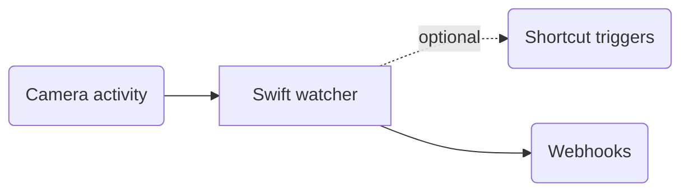

# CameraWatch

CameraWatch monitors webcam activity and sends webhook notifications when the camera starts or stops. It is designed for Home Assistant automations such as turning a home-office busy light on and off.

The repository includes:

- Windows support in `windows/` through PowerShell and Task Scheduler
- macOS support in `macos/` through a Swift watcher and a per-user LaunchAgent
- Optional macOS Shortcut triggers for camera activity

## Repository Layout

- `macos/` contains the macOS watcher, installer, and uninstaller.
- `windows/` contains the Windows watcher, installer, uninstaller, and background launcher.

## Webhook Payload

CameraWatch sends JSON payloads with the same shape on both platforms:

Camera active:
```json
{
  "user": "YourUsername",
  "processes": "process1,process2"
}
```

Camera inactive:
```json
{
  "user": "YourUsername",
  "processes": ""
}
```

On Windows, `processes` contains active webcam registry entries. On macOS, supported public APIs expose camera device usage, not owning app processes, so `processes` contains comma-separated active camera device names such as `MacBook Pro Camera`.

## macOS

<details>

<summary>Expand</summary>

### Requirements

- macOS 12 or later
- Apple Command Line Tools
- Optional: Shortcuts configured for camera activity triggers

Install Command Line Tools if needed:

```bash
xcode-select --install
```

### How It Works

The macOS watcher uses CoreMediaIO to enumerate camera devices and checks whether each device is running anywhere on the system. It polls every 15 seconds by default. On state changes, it sends direct webhooks to Home Assistant.

Shortcut triggers are optional. When enabled, CameraWatch runs one Shortcut when the camera becomes active and another when the camera becomes inactive. Those Shortcuts can perform any automation, such as turning a macOS Focus mode on and off:




### Installation

For guided setup, run:

```bash
./macos/Install-CameraWatch.sh
```

The installer prompts for Home Assistant webhook URLs, poll interval, optional Shortcut triggers, and whether to start immediately. On reinstall, pressing Enter keeps existing settings; enter `-` at a webhook prompt to remove that URL. Guided setup requires an interactive terminal.

For scripted or non-interactive installation without Shortcut triggers:

```bash
./macos/Install-CameraWatch.sh \
  --webhook-url "https://your-homeassistant-url/api/webhook/on-id" \
  --webhook-url-sign-off "https://your-homeassistant-url/api/webhook/off-id" \
  --non-interactive
```

For scripted installation with existing Shortcuts, pass their names or identifiers:

```bash
./macos/Install-CameraWatch.sh \
  --webhook-url "https://your-homeassistant-url/api/webhook/on-id" \
  --webhook-url-sign-off "https://your-homeassistant-url/api/webhook/off-id" \
  --camera-active-shortcut "CameraWatch Camera Active" \
  --camera-inactive-shortcut "CameraWatch Camera Inactive" \
  --non-interactive
```

The installer compiles the Swift watcher, writes configuration, creates a LaunchAgent, and starts CameraWatch immediately by default.

### Shortcut Trigger Setup

Create two Shortcuts in the Shortcuts app. They can run any actions needed for camera activity. For example, to control macOS Focus:

- `CameraWatch Camera Active`: use the "Set Focus" action to turn your chosen Focus on until turned off.
- `CameraWatch Camera Inactive`: use the "Set Focus" action to turn the same Focus off.

When Shortcut triggers are enabled, the installer validates that both Shortcuts exist. Use `--skip-shortcut-check` if you want to install first and create the Shortcuts later.

Passing either `--camera-active-shortcut` or `--camera-inactive-shortcut` also enables Shortcut triggers automatically. Existing installations using the earlier Focus-named config keys or installer flags remain supported.

Use `--interactive` together with selected options to prompt only for remaining settings, or `--non-interactive` to suppress prompts when running from automation.

### macOS Configuration

Config is stored at:

```text
~/Library/Application Support/CameraWatch/config.json
```

Example:

```json
{
  "WebhookUrl": "https://your-homeassistant-url/api/webhook/on-id",
  "WebhookUrlSignOff": "https://your-homeassistant-url/api/webhook/off-id",
  "PollIntervalSeconds": 15,
  "ShortcutTriggersEnabled": false,
  "CameraActiveShortcut": "CameraWatch Camera Active",
  "CameraInactiveShortcut": "CameraWatch Camera Inactive",
  "ShortcutTimeoutSeconds": 20
}
```

Logs are stored at:

```text
~/Library/Logs/CameraWatch/CameraWatch.log
```

### Managing macOS CameraWatch

Check status:

```bash
launchctl print gui/$UID/com.camerawatch.agent
```

Restart:

```bash
launchctl kickstart -k gui/$UID/com.camerawatch.agent
```

Stop and unload:

```bash
launchctl bootout gui/$UID ~/Library/LaunchAgents/com.camerawatch.agent.plist
```

View logs:

```bash
tail -f ~/Library/Logs/CameraWatch/CameraWatch.log
```

Run one dry check manually:

```bash
"$HOME/Library/Application Support/CameraWatch/camerawatch" --once --dry-run
```

Test webhooks or Shortcut triggers:

```bash
"$HOME/Library/Application Support/CameraWatch/camerawatch" --test-notification on --dry-run
"$HOME/Library/Application Support/CameraWatch/camerawatch" --test-notification off --dry-run
"$HOME/Library/Application Support/CameraWatch/camerawatch" --test-shortcut on --dry-run
"$HOME/Library/Application Support/CameraWatch/camerawatch" --test-shortcut off --dry-run
```

### macOS Uninstallation

Remove the LaunchAgent and installed watcher binary:

```bash
./macos/Uninstall-CameraWatch.sh
```

Also remove configuration and logs:

```bash
./macos/Uninstall-CameraWatch.sh --remove-config
```

</details>

## Windows

<details>

<summary>Expand</summary>

### Requirements

- Windows 10 or later
- PowerShell 5.1 or later
- Permissions to create scheduled tasks; Administrator is recommended but not required

### How It Works

The Windows script monitors the registry key that tracks webcam usage:

```text
HKEY_USERS\{SID}\SOFTWARE\Microsoft\Windows\CurrentVersion\CapabilityAccessManager\ConsentStore\webcam
```

It polls this registry location every 15 seconds. When a state change is detected, it sends a POST request to the configured webhook URL.

### Installation

Open PowerShell, navigate to the repository, and run:

```powershell
.\windows\Install-CameraWatch.ps1
```

With webhook URLs:

```powershell
.\windows\Install-CameraWatch.ps1 `
  -WebhookUrl "https://your-homeassistant-url/api/webhook/on-id" `
  -WebhookUrlSignOff "https://your-homeassistant-url/api/webhook/off-id"
```

The script creates a scheduled task that runs automatically when you log in.

### Windows Configuration

Config is stored at:

```text
%LOCALAPPDATA%\CameraWatch\config.json
```

Example:

```json
{
  "WebhookUrl": "https://your-homeassistant-url/api/webhook/on-id",
  "WebhookUrlSignOff": "https://your-homeassistant-url/api/webhook/off-id"
}
```

Logs are stored at:

```text
%LOCALAPPDATA%\CameraWatch\CameraWatch.log
```

### Managing Windows CameraWatch

Check status:

```powershell
Get-ScheduledTask -TaskName "CameraWatch" -TaskPath "\CameraWatch\" | Get-ScheduledTaskInfo
```

Start:

```powershell
Start-ScheduledTask -TaskName "CameraWatch" -TaskPath "\CameraWatch\"
```

Stop:

```powershell
Stop-ScheduledTask -TaskName "CameraWatch" -TaskPath "\CameraWatch\"
```

View logs:

```powershell
Get-Content "$env:LOCALAPPDATA\CameraWatch\CameraWatch.log" -Tail 50
```

### Windows Uninstallation

```powershell
.\windows\Uninstall-CameraWatch.ps1
```

Also remove configuration and logs:

```powershell
.\windows\Uninstall-CameraWatch.ps1 -RemoveConfig
```
</details>

## Home Assistant Integration

1. Create one webhook trigger for camera active and one webhook trigger for camera inactive.
2. Configure CameraWatch with both webhook URLs.
3. Use the active webhook to turn on a busy indicator.
4. Use the inactive webhook to turn it off.

## Troubleshooting

### macOS: CameraWatch does not start

- Check the LaunchAgent status with `launchctl print gui/$UID/com.camerawatch.agent`.
- Check `~/Library/Logs/CameraWatch/CameraWatch.log`.
- Re-run the installer after installing Command Line Tools.

### macOS: Shortcut triggers do not work

- Confirm both Shortcuts exist with `shortcuts list --show-identifiers`.
- Run the test commands with `--test-shortcut on` and `--test-shortcut off`.
- macOS may ask for permission the first time a LaunchAgent runs Shortcuts.

### Webhook not working

- Verify the webhook URLs in the config file.
- Check logs for redacted webhook attempts and HTTP errors.
- Test the webhook URL manually with `curl` or Postman.

### Camera not detected

- On Windows, confirm the webcam uses the standard Windows camera APIs.
- On macOS, confirm the camera is exposed through CoreMediaIO.

## License

This project is open source. Feel free to use and modify as needed.
